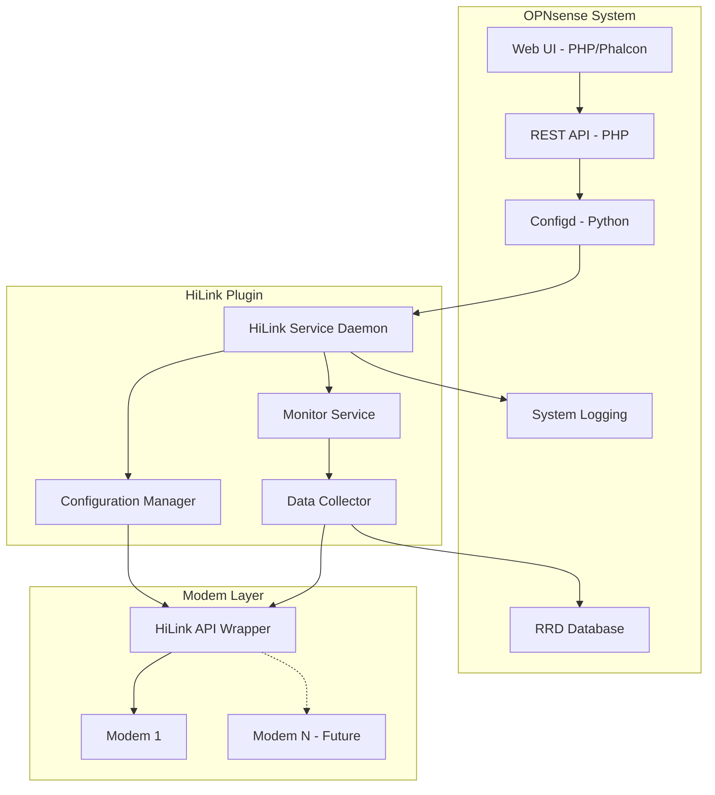

# OPNsense HiLink Modem Plugin Architecture

## Overview
This plugin provides monitoring and configuration capabilities for HiLink-based Huawei 4G USB modems in OPNsense firewalls. The architecture is designed to support multiple modems while initially implementing single modem functionality.

## Supported Devices
- Huawei E3372s series (including E3372s-153)
- Huawei E3372h series (E3372h-320, E3372h-153)
- Huawei E8372h series (future support)

## Architecture Components

### 1. Core Components



### 2. Directory Structure

```
opn/
├── src/
│   ├── opnsense/
│   │   ├── mvc/
│   │   │   ├── app/
│   │   │   │   ├── controllers/
│   │   │   │   │   └── OPNsense/HiLink/
│   │   │   │   │       ├── Api/
│   │   │   │   │       │   ├── ServiceController.php
│   │   │   │   │       │   ├── SettingsController.php
│   │   │   │   │       │   └── MonitorController.php
│   │   │   │   │       └── IndexController.php
│   │   │   │   ├── models/
│   │   │   │   │   └── OPNsense/HiLink/
│   │   │   │   │       ├── HiLink.xml
│   │   │   │   │       ├── HiLink.php
│   │   │   │   │       └── ACL.xml
│   │   │   │   └── views/
│   │   │   │       └── OPNsense/HiLink/
│   │   │   │           └── index.volt
│   │   │   └── www/
│   │   │       └── js/
│   │   │           └── hilink/
│   │   │               └── hilink.js
│   │   ├── scripts/
│   │   │   ├── hilink/
│   │   │   │   ├── hilink_service.py
│   │   │   │   ├── hilink_monitor.py
│   │   │   │   ├── hilink_collector.py
│   │   │   │   └── lib/
│   │   │   │       ├── __init__.py
│   │   │   │       ├── hilink_api.py
│   │   │   │       ├── config_manager.py
│   │   │   │       └── data_store.py
│   │   │   └── OPNsense/
│   │   │       └── HiLink/
│   │   │           └── setup.sh
│   │   ├── service/
│   │   │   ├── conf/
│   │   │   │   └── actions.d/
│   │   │   │       └── actions_hilink.conf
│   │   │   └── templates/
│   │   │       └── OPNsense/
│   │   │           └── HiLink/
│   │   │               └── +TARGETS
│   │   └── www/
│   │       └── widgets/
│   │           └── hilink.widget.php
├── tests/
│   ├── unit/
│   │   ├── test_hilink_api.py
│   │   ├── test_config_manager.py
│   │   └── test_data_store.py
│   └── integration/
│       ├── test_service.py
│       └── test_monitoring.py
├── docs/
│   ├── USER_GUIDE.md
│   ├── DEVELOPER.md
│   └── API.md
├── pkg/
│   ├── +MANIFEST
│   ├── +PRE_INSTALL
│   ├── +POST_INSTALL
│   └── +DESCR
├── .github/
│   └── workflows/
│       ├── test.yml
│       └── build.yml
├── Makefile
├── requirements.txt
└── README.md
```

## Component Details

### 1. Backend Service (Python)

#### hilink_service.py
Main daemon that manages:
- Service lifecycle
- Configuration updates
- Modem connection management
- Event handling

#### hilink_monitor.py
Monitoring component:
- Signal strength (RSSI, RSRP, RSRQ, SINR)
- Connection status
- Network type (2G/3G/4G/5G)
- Data usage statistics
- Connection uptime

#### hilink_collector.py
Data collection service:
- Periodic data collection (configurable interval)
- RRD database updates
- Historical data management (30 days default, configurable)
- Data aggregation for multiple modems (future)

#### lib/hilink_api.py
Python wrapper for HiLink API:
- Based on existing hilinkapi implementation
- Connection pooling for multiple modems
- Error handling and retry logic
- Authentication management

### 2. Web Interface (PHP/Phalcon)

#### Controllers
- **ServiceController**: Start/stop/restart service
- **SettingsController**: Configuration management
- **MonitorController**: Real-time monitoring data

#### Models
- Configuration model (XML-based)
- Validation rules
- Default values

#### Views
- Dashboard with real-time stats
- Configuration forms
- Historical graphs
- Alert management

### 3. Configuration Schema

```xml
<model>
    <mount>//OPNsense/hilink</mount>
    <description>HiLink modem configuration</description>
    <items>
        <general>
            <enabled type="BooleanField">
                <default>1</default>
                <Required>Y</Required>
            </enabled>
            <update_interval type="IntegerField">
                <default>30</default>
                <MinimumValue>10</MinimumValue>
                <MaximumValue>300</MaximumValue>
                <ValidationMessage>Update interval must be between 10 and 300 seconds</ValidationMessage>
            </update_interval>
            <data_retention type="IntegerField">
                <default>30</default>
                <MinimumValue>1</MinimumValue>
                <MaximumValue>365</MaximumValue>
                <ValidationMessage>Data retention must be between 1 and 365 days</ValidationMessage>
            </data_retention>
        </general>
        <modems>
            <modem type="ArrayField">
                <name type="TextField">
                    <Required>Y</Required>
                    <mask>/^[a-zA-Z0-9_-]+$/</mask>
                </name>
                <enabled type="BooleanField">
                    <default>1</default>
                </enabled>
                <ip_address type="NetworkField">
                    <Required>Y</Required>
                    <default>192.168.8.1</default>
                </ip_address>
                <username type="TextField">
                    <default>admin</default>
                </username>
                <password type="PasswordField">
                    <Required>N</Required>
                </password>
                <auto_connect type="BooleanField">
                    <default>1</default>
                </auto_connect>
                <roaming_enabled type="BooleanField">
                    <default>0</default>
                </roaming_enabled>
                <max_idle_time type="IntegerField">
                    <default>0</default>
                    <MinimumValue>0</MinimumValue>
                    <MaximumValue>86400</MaximumValue>
                </max_idle_time>
                <network_mode type="OptionField">
                    <default>auto</default>
                    <OptionValues>
                        <auto>Automatic</auto>
                        <4g_preferred>4G Preferred</4g_preferred>
                        <3g_preferred>3G Preferred</3g_preferred>
                        <4g_only>4G Only</4g_only>
                        <3g_only>3G Only</3g_only>
                    </OptionValues>
                </network_mode>
                <failover>
                    <enabled type="BooleanField">
                        <default>0</default>
                    </enabled>
                    <check_interval type="IntegerField">
                        <default>60</default>
                    </check_interval>
                    <max_failures type="IntegerField">
                        <default>3</default>
                    </max_failures>
                </failover>
            </modem>
        </modems>
        <alerts>
            <low_signal_threshold type="IntegerField">
                <default>-90</default>
                <MinimumValue>-120</MinimumValue>
                <MaximumValue>-50</MaximumValue>
            </low_signal_threshold>
            <data_limit_enabled type="BooleanField">
                <default>0</default>
            </data_limit_enabled>
            <data_limit_mb type="IntegerField">
                <default>10240</default>
            </data_limit_mb>
            <email_alerts type="BooleanField">
                <default>0</default>
            </email_alerts>
        </alerts>
    </items>
</model>
```

## Monitoring Metrics

### Real-time Metrics
- **Connection Status**: Connected/Disconnected
- **Network Type**: 2G/3G/4G/5G
- **Signal Strength**: RSSI (dBm)
- **Signal Quality**: RSRP, RSRQ, SINR
- **Data Usage**: Upload/Download (bytes)
- **Connection Uptime**: Duration since last connect
- **IP Address**: Current WAN IP
- **Network Operator**: Carrier name

### Historical Metrics (RRD)
- Signal strength over time
- Data usage trends
- Connection stability
- Network type changes
- Roaming events

## Features Implementation

### Phase 1: Core Functionality
1. Single modem support
2. Basic monitoring (signal, status, data)
3. Manual connect/disconnect
4. Web UI dashboard
5. Configuration interface

### Phase 2: Advanced Features
1. Auto-connect/disconnect based on schedule
2. Roaming configuration
3. Network mode selection
4. Data usage alerts
5. Email notifications

### Phase 3: Multi-modem Support
1. Multiple modem management
2. Load balancing
3. Failover support
4. Aggregated statistics
5. Per-modem policies

## Build System

### Makefile Targets
```makefile
all: build test package

build:
    - Compile Python modules
    - Minify JavaScript
    - Generate documentation

test:
    - Run unit tests
    - Run integration tests
    - Code coverage report

package:
    - Create OPNsense package
    - Generate checksums
    - Create release artifacts

install:
    - Install to local OPNsense

clean:
    - Remove build artifacts
    - Clean test results
```

## Testing Strategy

### Unit Tests
- API wrapper functions
- Configuration validation
- Data collection logic
- Service management

### Integration Tests
- End-to-end modem communication
- Web UI functionality
- Service lifecycle
- Data persistence

### Manual Testing
- Multiple modem models
- Various network conditions
- Failover scenarios
- Performance testing

## Security Considerations

1. **Credentials Storage**: Encrypted storage of modem passwords
2. **API Authentication**: Secure token management
3. **Input Validation**: Strict validation of all user inputs
4. **Network Isolation**: Modem network segregation
5. **Logging**: Audit trail for all operations

## Performance Optimization

1. **Connection Pooling**: Reuse HTTP connections
2. **Caching**: Cache static modem information
3. **Batch Operations**: Group API calls when possible
4. **Async Processing**: Non-blocking operations
5. **Resource Limits**: CPU and memory constraints

## Error Handling

1. **Graceful Degradation**: Continue operation if modem unavailable
2. **Retry Logic**: Exponential backoff for failed operations
3. **Error Logging**: Detailed error messages for debugging
4. **User Notifications**: Clear error messages in UI
5. **Recovery Actions**: Automatic recovery attempts

## Deployment

### GitHub Actions CI/CD
1. **Test Pipeline**: Run on every push
2. **Build Pipeline**: Create packages on tags
3. **Release Pipeline**: Publish to GitHub releases
4. **Documentation**: Auto-generate API docs

### Installation Process
1. Upload package to OPNsense
2. Install via package manager
3. Configure through web UI
4. Start service
5. Verify operation

## Future Enhancements

1. **5G Support**: Add support for 5G modems
2. **SMS Management**: Send/receive SMS
3. **Band Locking**: Force specific frequency bands
4. **VPN Integration**: Auto-connect VPN on modem connection
5. **REST API**: External monitoring integration
6. **Grafana Dashboard**: Advanced visualization
7. **Multi-WAN**: Integration with OPNsense multi-WAN
8. **QoS Integration**: Traffic shaping based on signal quality